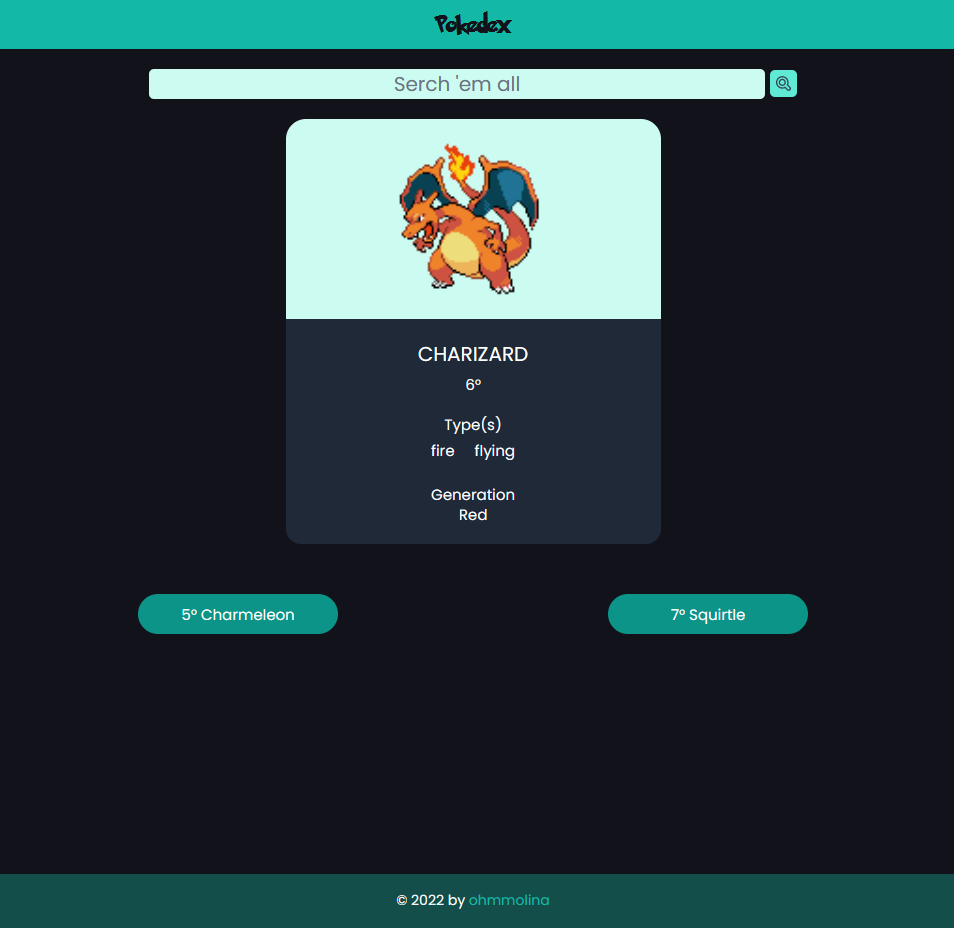

# **POKEDEX**

Encuentra la app desplegada **[aqui](https://ohm-pokedex.web.app/)**.

## ***VueJS + VueRouter + Pinia + Tailwind + Firebase***

### Web app sencilla, consumiendo *[PokeApi](https://pokeapi.co/)*.
#### Version 0.1.0 (Minima entregable)  
- Muestra en una tarjeta la imagen, el nombre, el(los) tipos y la generación en la que aparece.
- El buscador funciona tanto con nombres como con números. Si no se ingresa una busqueda y se presiona el boton de buscar (o se presiona enter), se genera una tarjeta de pokemon aleatoria.
- Los componentes se reducen a sus expresiones mínimas que permitan asignar funcionalidad de manera dinámica.
- Estados gestionados con **Pinia** *(Vuex 5)* desde un único almacén *(pokemon.js)*
- Estilos creados con **Tailwind**. Se creo un color personalizado en *tailwind.confi.js*, pero el resto de variables se manejaron con "valores arbitrarios" por velocidad en el desarrollo.
- Despliegue a traves de **Firebase Hosting**.

#### Notas
- Fuente Pokemon Solid no se muestra en la compilación.